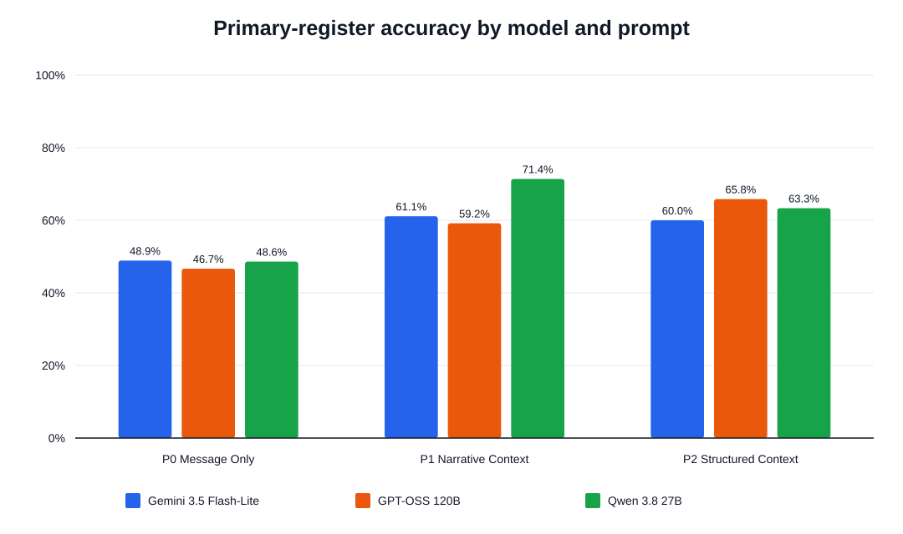
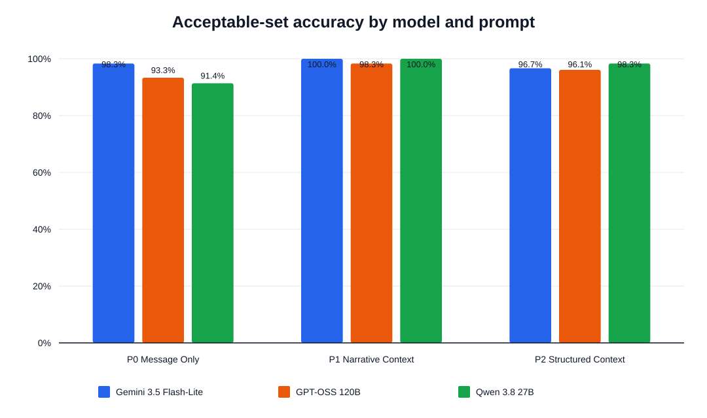
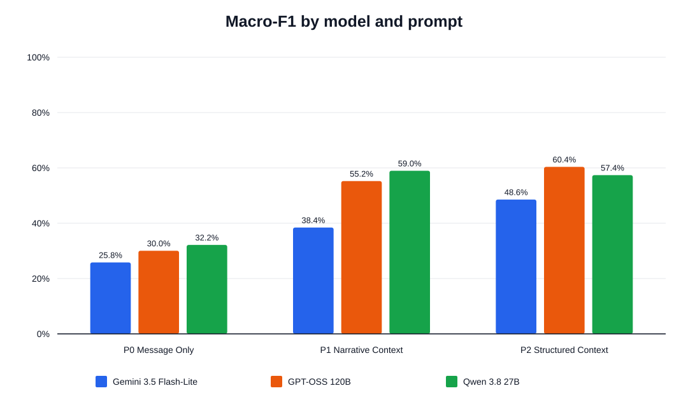
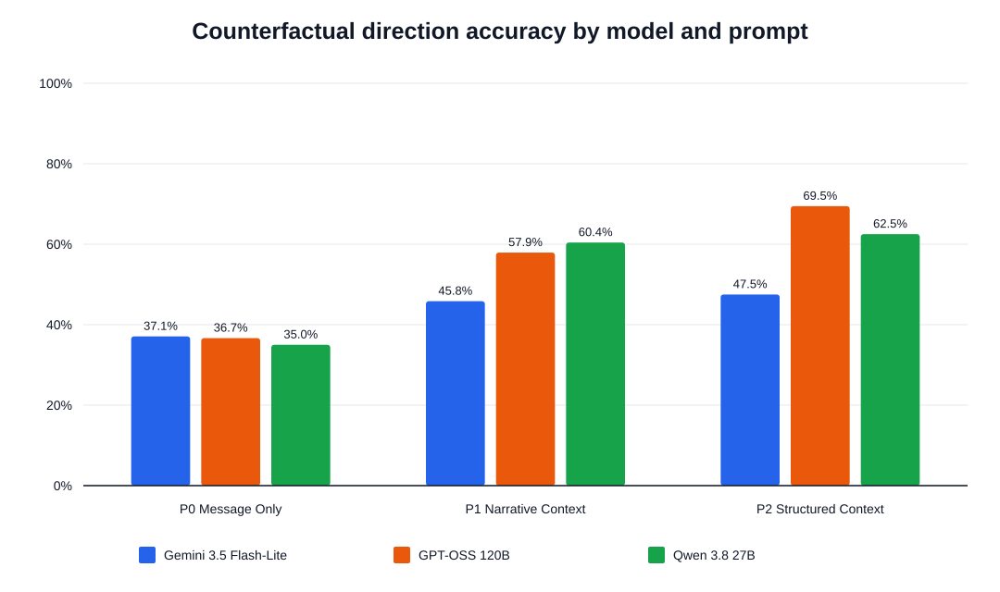

# SocialCue-BN Core Experiment Report — FINAL_TEST360

**Status:** FINAL  
**Split:** TEST  
**Unique instances per model:** 360  
**Prompt conditions:** 3  
**Models:** 3  
**Total evaluated records:** 3240  
**Generated at:** 2026-09-05T03:33:15.787045Z

## Interpretation Rule

This report was generated automatically from immutable JSONL outputs and the frozen gold benchmark. These values represent the complete requested evaluation scope.

## Combined Performance Table

| Model | Prompt | Primary accuracy | Acceptable-set accuracy | Macro-F1 | Counterfactual accuracy | Parseable | Mean latency (ms) | Total tokens |
|---|---|---:|---:|---:|---:|---:|---:|---:|
| Gemini 3.5 Flash-Lite | P0 Message Only | 48.9% | 98.3% | 0.258 | 37.1% | 100.0% | 2409.0 | 87499 |
| Gemini 3.5 Flash-Lite | P1 Narrative Context | 61.1% | 100.0% | 0.384 | 45.8% | 100.0% | 2874.7 | 99072 |
| Gemini 3.5 Flash-Lite | P2 Structured Context | 60.0% | 96.7% | 0.486 | 47.5% | 100.0% | 2680.8 | 202375 |
| GPT-OSS 120B | P0 Message Only | 46.7% | 93.3% | 0.300 | 36.7% | 100.0% | 862.3 | 139602 |
| GPT-OSS 120B | P1 Narrative Context | 59.2% | 98.3% | 0.552 | 57.9% | 100.0% | 769.1 | 144096 |
| GPT-OSS 120B | P2 Structured Context | 65.8% | 96.1% | 0.604 | 69.5% | 99.7% | 1288.3 | 254580 |
| Qwen 3.8 27B | P0 Message Only | 48.6% | 91.4% | 0.322 | 35.0% | 100.0% | 518.0 | 93228 |
| Qwen 3.8 27B | P1 Narrative Context | 71.4% | 100.0% | 0.590 | 60.4% | 100.0% | 570.6 | 108620 |
| Qwen 3.8 27B | P2 Structured Context | 63.3% | 98.3% | 0.574 | 62.5% | 100.0% | 608.9 | 204546 |

## Figures

## Validation Warnings

- None

## Generated Files

- `combined_metrics.csv`
- `combined_metrics.json`
- `predictions_long.csv`
- `error_cases.csv`
- `confusion_matrices.csv`
- `run_manifest.json`
- four SVG figures
- this Markdown report and `report.html`
